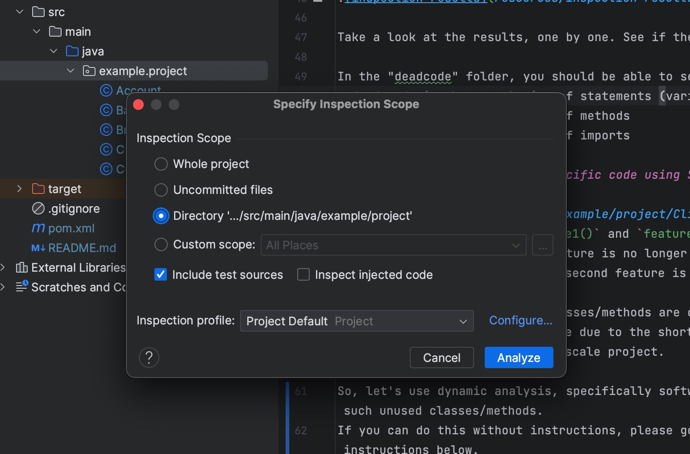
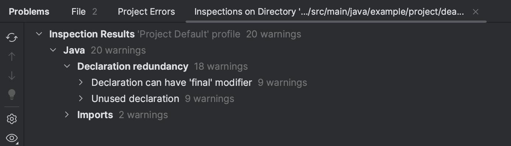

# Unnecessary Code

This repository includes lab materials to support the Spring Semester of the COM3523/6523 module "Software Reengineering" at the University of Sheffield.

In this week, we explore "unnecessary code".

## Important Notes

We don't have a list of tests that check your progress in this week, mainly because "removing unnecessary code" is not something that can be easily tested.

However, we do have a list of tasks you need to complete. This is to give you a better idea on how unnecessary code looks like in different granularities (e.g., statements, methods, classes, etc.). and how to identify/remove them.

## Part 0: Setup

This part is to set up your own repository and understand the code in the repository.

### Step 1: Clone your repository
First, clone this repository to your local machine
(e.g., the user drive in the University computer; `u:/Teaching/COM3523/2022-23` in my case).
Open `Git Bash` and enter the following commands:

```bash
cd u:/Teaching/COM3523/2022-23
git clone [YOUR_REPOSITORY_ADDRESS]
```

### Step 2: Take a look at the code
Now, take a look at the code you just cloned.
If you want, open the project in IntelliJ and browse the files in it.
For those who wants to install IntelliJ 2022 on your shared drive (/U:),
please refer to [this guideline](/resources/install-intellij-user-drive.md).

## Part 1: Unnecessary Code

This part is about dead code detection using IntelliJ.

### (Task1) Dead code detection using IntelliJ

Right-click the folder "example.project" in the project view, and select "Analyze | Inspect Code...". You should see the following window:



Click "Analyze" and wait for the inspection to finish. You should see the following window:



Take a look at the results, one by one. See if they are really dead code. 

In the "example.project" folder, you should be able to see:
- dead code in the granularity of statements (variables)
- dead code in the granularity of methods
- dead code in the granularity of imports

### (Task2) Identify feature-specific code using Software Reconnaissance

In [Client.java](src/main/java/example/project/Client.java), we have two client features implemented as `feature1()` and `feature2()`.
Let's assume that the second feature is no longer used by any users for a long time, i.e., the code related to the second feature is unused code.

Now, let's use dynamic analysis, specifically *software reconnaissance*, to identify the unused code (i.e., the code only required for `feature2()`) in the project.
If you don't know how to do it, please see the instructions below.

(Known issue: `-Djava.unit.logging.config.file=[LOGGING-PROPERTIES-FILE]` is not working properly, so the execution traces might simply be printed on the console instead of the file. Possibly a Java version or other library version issue. If you encounter this issue, please ignore it and just use the traces printed on the console.)

1. Make a wrapper main method that calls `feature1()` in [Client.java](src/main/java/example/project/Client.java).
2. Collect an execution trace of the wrapper main using the reengineering toolkit jar. To attach the jar as a java agent, you need to add the following VM options in the Run configuration of the main in IntelliJ (see Week 4 - Lab materials - Tutorial 1: Generating Traces of a Java program for more details):
```
-javaagent:[REENGINEERING_TOOLKIT_FAT_JAR]=exemples.project -Djava.unit.logging.config.file=[LOGGING-PROPERTIES-FILE]
```
3. Repeat steps 1-2 for `feature2()`.
4. Compare the execution traces of the two features and identify the methods required for `feature2()` but not for `feature1()`; they are the unused methods we can remove without affecting the rest of the system.


### (Task3) Understand the unused code in the project using call graphs

In Task 2, you identified the unused code that can be removed without affecting the rest of the system.
To double-check if this is correct, let's use static analysis to understand how the unused code is used in the project.
Feel free to use `CallGraphGenerator` in the reengineering toolkit (provided in Week 3 Lab or Assignment 1).

Briefly speaking, you need to:
1. Build a jar file of this project.
2. Run the `CallGraphGenerator` with the VM options specifying the above jar file and the program arguments specifying the absolute path to the compiled classes of this project (i.e., `.../target/classes`).

How does the call graph look like? Is the unused code identified from Task 2 can be safely removed? Can you discuss your answer based on the call graph?